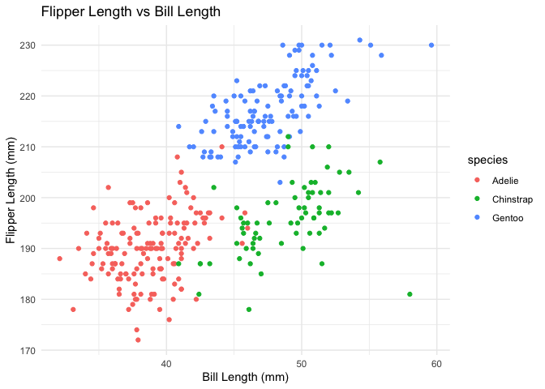

P8105 homework 1
================
Katherine Wang
2024-09-21

``` r
# load the required library packages
library(ggplot2)
library(tidyverse)
```

    ## ── Attaching core tidyverse packages ──────────────────────── tidyverse 2.0.0 ──
    ## ✔ dplyr     1.1.4     ✔ readr     2.1.5
    ## ✔ forcats   1.0.0     ✔ stringr   1.5.1
    ## ✔ lubridate 1.9.3     ✔ tibble    3.2.1
    ## ✔ purrr     1.0.2     ✔ tidyr     1.3.1
    ## ── Conflicts ────────────────────────────────────────── tidyverse_conflicts() ──
    ## ✖ dplyr::filter() masks stats::filter()
    ## ✖ dplyr::lag()    masks stats::lag()
    ## ℹ Use the conflicted package (<http://conflicted.r-lib.org/>) to force all conflicts to become errors

\##Question 1:

``` r
# first, load the penguins dataset:
data("penguins", package = "palmerpenguins")
#description of the penguins dataset:
#there are 8 variables: 1. species, 2. island, 3. bill_legth_mm, 4. bill_depth_mm, 5. flipper_length_mm, 6. body_mass_g, 7. sex, 8. year.  
rows=nrow(penguins)
cols=ncol(penguins)
#This dataset contains total 344 penguins with 3 species (gentoo, chinstrap, and adelie), and they from 3 island (biscoe, dream, and torgersen)
mean_flipper=mean(penguins$flipper_length_mm, na.rm = TRUE)
#the mean flipper length is approx. 200.92mm.
#to make the scatterplot of flipper_length_mm (y) vs. bill_length_mm (x):
ggplot(penguins, aes(y=flipper_length_mm,x=bill_length_mm))+geom_point(aes(color=species), na.rm=TRUE)+labs(
title="Flipper Length vs Bill Length", 
x="Bill Length (mm)", 
y="Flipper Length (mm)") + theme_minimal()
```

<!-- -->

``` r
ggsave("penguin_scatterplot.png")
```

    ## Saving 7 x 5 in image

\##Question 2

``` r
#first, set a random seed to achieve reproducible results.
set.seed(903)
#assign random samples, logical vectors, character vectors, and factor vectors to variables.
rand_sample = rnorm(10)
log_vec = rand_sample > 0
char_vec = letters[1:10]
fac_vec = factor(rep(c("Level 1", "Level 2", "Level 3"), length.out = 10))
#create a dataframe using previously defined variables.
df <- data.frame(rand_sample, log_vec, char_vec, fac_vec)  
#call the df to visualize the dataframe
df
```

    ##     rand_sample log_vec char_vec fac_vec
    ## 1  -0.587287590   FALSE        a Level 1
    ## 2   1.115441219    TRUE        b Level 2
    ## 3   0.666223070    TRUE        c Level 3
    ## 4   0.008098728    TRUE        d Level 1
    ## 5  -0.851879364   FALSE        e Level 2
    ## 6   0.959241255    TRUE        f Level 3
    ## 7   0.132891796    TRUE        g Level 1
    ## 8   0.490546071    TRUE        h Level 2
    ## 9  -0.615876899   FALSE        i Level 3
    ## 10 -0.755372870   FALSE        j Level 1

``` r
#try to take the mean of each variable in my dataframe.
mean_rand_sample <- mean(pull(df,rand_sample))
mean_log_vec <- mean(pull(df,log_vec))
mean_char_vec <- mean(pull(df,char_vec))
```

    ## Warning in mean.default(pull(df, char_vec)): argument is not numeric or
    ## logical: returning NA

``` r
mean_fac_vec <- mean(pull(df,fac_vec))
```

    ## Warning in mean.default(pull(df, fac_vec)): argument is not numeric or logical:
    ## returning NA

``` r
#visualize the outputs
mean_rand_sample
```

    ## [1] 0.05620254

``` r
mean_log_vec
```

    ## [1] 0.6

``` r
mean_char_vec
```

    ## [1] NA

``` r
mean_fac_vec
```

    ## [1] NA

``` r
#discuss: after the visualization, "mean_rand_sample" and "mean_log_vec" works, they have the mean values, which is -0.05094842 and 0.4, respectively. However, pulling the mean for "mean_char_vec"and "mean_fac_vec" did not work since both of the arguments are not numeric or logical, hence NA is returned for both. 

#convert logical, character, and factor variables to numeric data type.
conv_log_vec <- as.numeric(pull(df,log_vec))
conv_char_vec <- as.numeric(pull(df,char_vec))
```

    ## Warning: NAs introduced by coercion

``` r
conv_fac_vec <- as.numeric(pull(df,fac_vec))
#visualize the outputs
conv_log_vec
```

    ##  [1] 0 1 1 1 0 1 1 1 0 0

``` r
conv_char_vec
```

    ##  [1] NA NA NA NA NA NA NA NA NA NA

``` r
conv_fac_vec
```

    ##  [1] 1 2 3 1 2 3 1 2 3 1

``` r
#discuss: logical and factor variables could be converted to numeric data type, but the character variable couldn't (received a warning for trying to convert the character variable into numeric, and NAs were introduced by coercion). I expected logical variable to convert to numeric, but did not expect the factor variable to. It makes sense that the character variable could not be converted to numeric. This partially explains what happens when I tried to take the mean of the variables, but did not explain the phenomenon for factor variable.  
```
